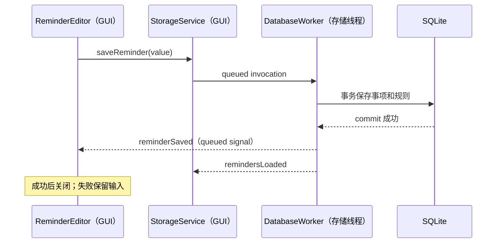

# C++20 与 Qt 代码导读

推荐从 main.cpp 开始，依次看 domain/types.h、domain/schedule.cpp、domain/pomodoro.cpp、storage/storage.cpp，然后阅读界面。先理解数据如何流动，再看绘制细节。

## 启动与所有权

main.cpp 创建 QApplication、日志、单实例锁、媒体服务、QSettings、主题、存储、番茄钟、调度器、平台适配、通知协调器和主窗口。它们多数是函数局部对象，作用域结束时按相反顺序销毁，这是 RAII。无需用全局裸指针管理应用生命周期。

窗口内部 new 的控件由父对象持有。setupUi 会设置父子关系，窗口销毁时控件自动销毁。不要再用另一个拥有所有权的 unique_ptr 管理同一子控件。

MainWindow 和 ReminderEditor 的 unique_ptr<Ui::...> 只管理生成的辅助对象。辅助对象本身不拥有控件。其析构函数定义在 .cpp 中，确保 unique_ptr 析构时 Ui 类型已完整定义。

QPointer 用于通知协调器中的活动弹窗：如果 QWidget 销毁，QPointer 自动清空。connect 指定接收者 context 后，接收者销毁会断开连接，避免 lambda 在窗口不存在时继续访问窗口。

## 业务值类型

Reminder、ScheduleRule、Occurrence 和 PomodoroSnapshot 是可复制的值对象。RuleKind、PomodoroPhase、PomodoroStatus 使用 enum class，编译器能防止不同状态类型混用。

ScheduleCalculator 返回 std::optional<QDateTime>。没有未来发生时间时返回 nullopt，调用者必须判断，而不是把无效时间或 0 当成特殊值继续调度。

每次提醒与提醒规则是不同对象：规则描述“每天 10:00”，occurrence 描述“2026-10-06 10:00 这一次”。稍后提醒只更新 occurrence 的 deliveryAt，不改变正常日程。

## 信号槽与异步存储

用户保存的完整流程：

QThread 对象本身在 GUI 线程中创建，DatabaseWorker 通过 moveToThread 移动到它管理的线程。数据库连接在 Worker::initialize 中创建，因此其线程归属正确。GUI 不能复制连接后直接查询。

StorageService 用 QMetaObject::invokeMethod 的 QueuedConnection 发送任务。函数立即返回，SQL 在工作线程执行。自定义值对象注册为 metatype，以便跨线程信号复制参数。只有 GUI 线程更新模型与 QWidget。

正常退出时用一次 BlockingQueuedConnection 关闭数据库：同一队列之前的写入先完成，然后关闭连接、退出线程。这种等待只用于退出收尾，不用于日常按钮操作。

## Model/View

ReminderListModel 继承 QAbstractListModel，为列表提供数据。替换列表时用 beginResetModel/endResetModel 告诉视图重新读取。搜索由 QSortFilterProxyModel 完成，界面选择项从代理模型取 ReminderRole 值。

ReminderDelegate 用 QPainter 绘制标题、时间摘要和状态，不给每一行创建一组长期存在的 QWidget。它使列表在事项增加时仍保持轻量。空列表文案与操作按钮状态由 MainWindow 管理。

## 两类时间

日程使用墙上时间和日历：人说“每天当地 10:00”，系统时区和夏令时会影响它。番茄钟使用单调时间：人说“工作 25 分钟”，修改系统时间不能凭空增加或减少专注时长。

QTimer 是回调通知，不能代表真的经过了一秒。PomodoroEngine 使用 QElapsedTimer 获取实际经过时长，再更新剩余值。界面隐藏后引擎仍运行；paintEvent 只画当前值，不负责推进业务状态。

## 错误处理与日志

SQL 的执行和 commit 都检查结果。Worker 把内部异常转换为 error 信号，异常不穿越 Qt 事件循环。事务失败 rollback，UI 保留编辑内容。INFO 日志记录对象 ID 与结果，默认不输出提醒正文。

学习时可以在 ReminderEditor 的保存回调、DatabaseWorker::saveReminder、ReminderScheduler::scan 和 NotificationCoordinator::showNext 上设置断点，观察跨线程调用顺序与对象值。
