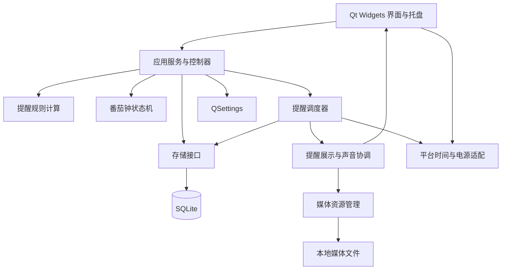
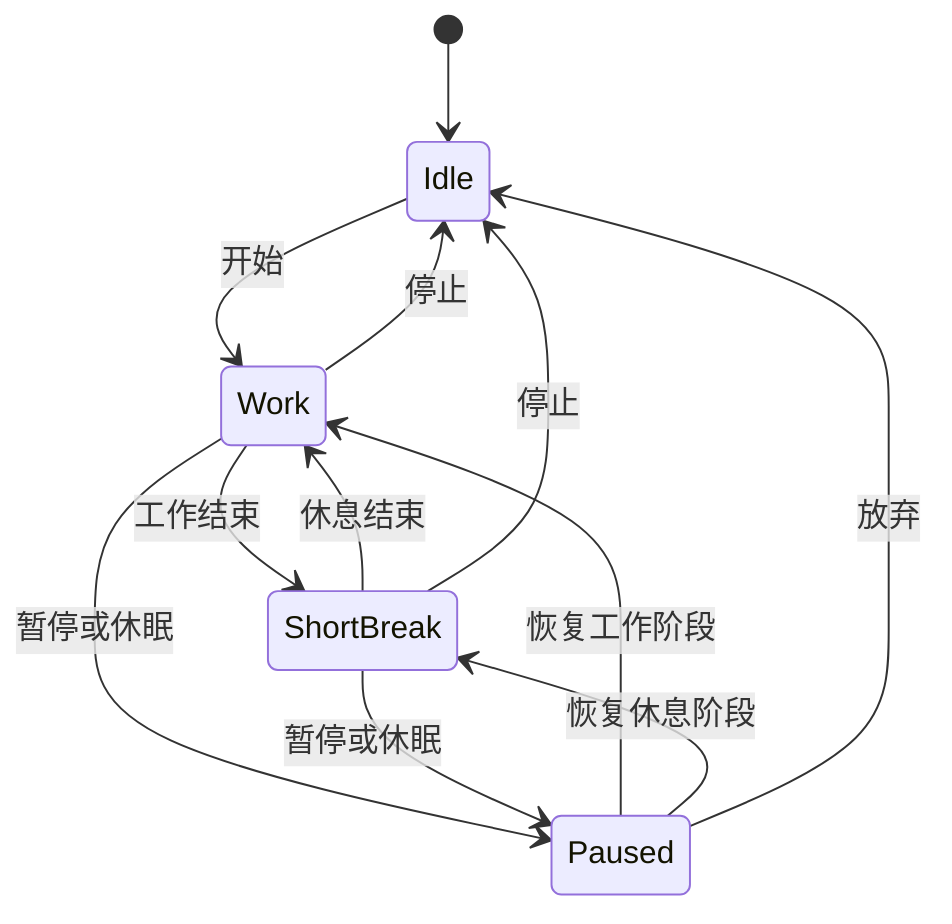

# qDing 实现方案与技术选型

方案日期：2026-10-05。目标：使用 C++20 与 Qt Widgets，开发可在 macOS 和 Windows 上运行的本地提醒与番茄钟软件，并把项目组织成适合学习 C++ 和 Qt 的工程。

本文是开发设计与验收依据。第一版代码已按此方向实现，当前功能和未实现的扩展以 README 为准。界面全部使用 Widgets 和 Qt Designer `.ui` 文件，不引入 Qt Quick、QML 或 WebEngine。

## 1. 建议采用的方案

采用 **C++20 + Qt 6 Widgets + CMake + SQLite/Qt SQL + QSettings + spdlog**。

主程序是当前登录用户会话中的常驻桌面应用。关闭主窗口后隐藏到托盘，调度器继续运行；托盘菜单中的“退出”结束进程。提醒使用自定义 QWidget 窗口，支持文字、图片、GIF 与声音。SQLite 保存提醒规则、触发记录和番茄钟记录；偏好设置用 QSettings；媒体保存为应用数据目录内的文件。

第一版采用 Fusion 控件风格，结合 QSS、QPalette 和少量 QPainter 自绘控件实现统一、现代的界面。浅色、深色、跟随系统作为内置主题，皮肤通过受控的 JSON 参数描述颜色、字体与间距。

## 2. 功能范围与建议补充项

### 2.1 第一版必须完成

| 功能 | 具体行为 | 验收例子 |
| --- | --- | --- |
| 后台运行 | 隐藏主窗口后继续调度；显式退出才结束 | 关闭窗口，10:00 仍能提醒 |
| 托盘/菜单栏 | 显示主窗口、开始/暂停番茄钟、勿扰、退出 | Windows 托盘与 macOS 菜单栏可操作 |
| 番茄钟 | 自定义工作与休息时长，连续循环，暂停、继续、停止 | 25 分钟工作、5 分钟休息反复切换 |
| 多个提醒 | 新增、编辑、删除、启用/禁用、复制、搜索 | 同时保存喝水和休息提醒 |
| 时间规则 | 指定日期一次、每天、周一至周五、自选星期 | 工作日 15:00，周六周日不触发 |
| 一个事项多个时间 | 一个事项可配置多条时间规则 | 喝水：每天 10:00 与 16:00 |
| 提醒内容 | 标题、正文、图片或 GIF、声音、音量、预览 | 编辑后立即预览提醒效果 |
| 提醒操作 | 完成、忽略、稍后提醒、停止声音 | 稍后 5 分钟再提醒当前这一轮 |
| 提醒历史 | 显示计划时间、实际展示时间、处理结果 | 查到提醒是否错过或被忽略 |
| 换肤 | 浅色、深色、跟随系统、主题色 | 切换后主窗口和提醒窗口一致 |
| 日志 | 运行日志、轮转、打开日志目录、诊断导出 | 排查为什么某次提醒没有显示 |
| 数据持久化 | 保存规则、媒体引用、番茄钟配置和运行快照 | 重启后提醒仍存在 |
| 学习文档 | 构建、架构、模块、关键算法、调试、发布文档 | 新开发者能按步骤构建与修改 |

### 2.2 应在第一版明确的行为

| 问题 | 建议默认值 |
| --- | --- |
| 点击窗口关闭按钮 | 隐藏到托盘，第一次显示一次说明 |
| 系统托盘不可用 | 保留主窗口，避免应用隐藏后无法找回 |
| 登录时启动 | 用户可选，默认关闭；启用后后台启动 |
| 重复打开应用 | 唤起已有实例，避免两份调度器重复提醒 |
| 睡眠期间的定时提醒 | 唤醒后按错过策略处理 |
| 错过提醒 | 10 分钟内补提醒，同事项合并为最近一次；超过窗口记入历史 |
| 番茄钟遇到系统休眠 | 自动暂停；唤醒后保持暂停，由用户继续 |
| 番茄钟遇到进程退出 | 重启后恢复为暂停，允许继续或放弃 |
| 勿扰 | 停止弹窗与声音，调度继续，结果可查；结束后按补提醒策略合并 |
| 锁屏 | 不尝试在锁屏界面绘制窗口，解锁后按策略处理 |
| 同时多个提醒 | 合并或排队展示，声音不重叠播放 |
| 工作日 | 第一版定义为周一至周五；界面明确说明不含节假日调休 |
| 时间精度 | 第一版提醒设置精确到分钟，运行中允许少量调度延迟 |
| 时区 | 默认跟随系统本地时区；数据模型保留固定时区能力 |

10 分钟补提醒是产品默认策略，可在设置中调整，也可对单个事项设置“跳过”或“恢复后提醒最近一次”。无法保证电脑关机或应用完全退出时仍弹出自定义窗口。第一版通过登录启动和恢复补偿覆盖常见使用场景。

### 2.3 后续扩展

- 每隔 N 分钟提醒，并限制在指定时间范围，例如 09:00–18:00。
- 每月/每年提醒、排除日期、法定节假日与调休日历。
- 每完成 N 个工作阶段进入长休息；番茄钟配置预设与统计。
- 全局快捷键、桌面小计时窗口、导入导出与备份恢复。
- 原生系统通知、通知操作按钮、应用内历史联动。
- 云同步、多设备与自动更新。需要明确需求后再引入网络服务。

## 3. 技术选型与版本策略

| 领域 | 选型 | 原因与使用范围 |
| --- | --- | --- |
| 语言 | C++20 | 强类型、RAII、chrono、标准容器；不为使用新特性而复杂化代码 |
| 框架 | Qt 6 | Core、Gui、Widgets、Sql、Multimedia、Network、Test |
| 界面 | Qt Widgets | QMainWindow、QDialog、QWidget、布局、Model/View |
| 外观 | Fusion + QSS + QPalette | 跨平台基础外观统一；主题色和绘制参数集中管理 |
| 特殊绘制 | QPainter、QPropertyAnimation | 番茄钟圆环、平滑展开、轻量状态动画 |
| 界面编辑 | Qt Designer 的 .ui + C++ | 固定表单和页面用 Designer，自绘控件用 C++ |
| 构建 | CMake + Ninja + CMakePresets | 统一开发和 CI 构建参数，启用 AUTOMOC/AUTOUIC/AUTORCC |
| 数据 | Qt SQL 的 QSQLITE 驱动 | 本地、嵌入式、无须安装数据库服务 |
| 偏好 | QSettings | 主题、音量、窗口几何、关闭行为等简单键值 |
| 日志 | spdlog | 级别、多个输出目标、文件轮转、按需异步 |
| 定时 | QTimer + 可注入时钟 | QTimer 负责唤醒；规则计算与计时不依赖回调次数 |
| 图片 | QImageReader/QPixmap | 检查与解码，按目标尺寸缩放 |
| GIF | QMovie + QLabel | Widgets 中播放动画，关闭或隐藏时停止 |
| 声音 | QSoundEffect；QMediaPlayer + QAudioOutput | 短 WAV 提示音用前者，自定义压缩音频用后者 |
| 单实例 | QLockFile + QLocalServer/QLocalSocket | 锁负责互斥，本地 IPC 唤起已有窗口 |
| 路径 | QStandardPaths | 使用平台用户数据目录，不写入安装目录 |
| 测试 | Qt Test + CTest | 规则、状态机、数据库和必要的界面集成测试 |
| 注释文档 | 中文 Markdown + Doxygen | 核心概念用中文解释，标识符采用清晰英文 |
| 依赖管理 | Qt 官方 SDK + 固定版本 spdlog | 第一版用 CMake FetchContent 固定版本或提交，不跟随 master |

接口兼容基线可设为 Qt 6.8，但正式开发应锁定当时能获取、仍维护且满足目标操作系统的具体 Qt 6 小版本与补丁版本。不能把“LTS”理解为所有后续补丁都能免费取得。README、CI 和本地 Preset 必须使用同一版本组合。

首发测试目标建议为 Windows 11 x64 与 macOS 14+ arm64。Intel Mac 作为第二构建产物按需要加入。更旧系统与 Windows ARM64 的支持须结合选定 Qt 版本的支持矩阵和实机验证确定。macOS 使用 Apple Clang/Xcode，Windows 使用 MSVC 2022；选择与 Qt SDK 匹配的工具链。参考：[Qt 支持平台](https://doc.qt.io/qt-6.8/supported-platforms.html)。

Qt Widgets 支持控件、布局、绘制和 Model/View；QSS 可定制控件外观。[Widgets 文档](https://doc.qt.io/qt-6.8/qtwidgets-index.html)、[QSS 文档](https://doc.qt.io/qt-6.8/stylesheet.html)。

## 4. 架构与模块职责

采用分层、单进程架构。业务逻辑不放在按钮回调或窗口类里，数据库访问不散落在界面代码中。



| 模块/类 | 职责 |
| --- | --- |
| ApplicationController | 创建模块、装配依赖、控制启动和退出顺序 |
| ReminderService | 校验新增编辑请求，提交后更新模型与调度器 |
| ScheduleCalculator | 纯规则计算：给定规则和时间，求下一次触发时间 |
| ReminderScheduler | 维护最近到期事项，处理恢复、时间变化与去重 |
| NotificationCoordinator | 管理提醒队列、勿扰、窗口数量和声音互斥 |
| PomodoroEngine | 工作/休息状态机、暂停恢复、循环次数与快照 |
| ReminderRepository | 提醒、规则与触发记录的存储接口 |
| SqliteRepository/DatabaseWorker | 执行 SQL、事务、迁移与查询 |
| ReminderListModel | 供列表使用的 QAbstractListModel，不直接执行 SQL |
| ThemeManager | 载入主题参数，更新 palette、QSS 和自绘控件 |
| MediaService | 导入、校验、复制、定位、去重和清理资源 |
| TrayController | 托盘图标、菜单、状态文字、唤起主窗口 |
| PlatformIntegration | 登录启动、休眠/唤醒、锁屏、原生通知的适配接口 |
| Clock | 当前 UTC、本地时区与单调时间的可替换接口 |
| LoggingService | spdlog 初始化、Qt 日志接入、轮转与诊断导出 |

规则计算使用普通 C++ 类型或 Qt 值类型；不需要 QWidget、真实计时器和真实数据库即可测试。对 Repository 与 Clock 引入接口，方便使用内存实现与假时钟。第一版不引入完整依赖注入框架、插件框架或事件总线。

## 5. 项目目录规划

下列为后续实现目录；本方案阶段仅创建设计文档。

```text
qDing/
├── CMakeLists.txt
├── CMakePresets.json
├── README.md
├── cmake/                     # 依赖、编译选项、部署辅助
├── src/
│   ├── main.cpp
│   ├── app/                   # 应用装配、生命周期
│   ├── domain/                # 提醒规则、番茄钟状态、值对象
│   ├── services/              # 调度、提醒、媒体、主题
│   ├── storage/               # Repository、Qt SQL、迁移
│   ├── models/                # Qt Model/View 数据模型
│   ├── ui/
│   │   ├── windows/           # 主窗口、提醒窗口
│   │   ├── pages/             # 今日、提醒、番茄钟、历史、设置
│   │   ├── dialogs/           # 编辑器、媒体预览、主题选择
│   │   └── widgets/           # 圆环、时间选择、星期选择
│   ├── platform/
│   │   ├── macos/             # 必要的 Objective-C++ .mm 适配
│   │   └── windows/           # Win32 适配
│   └── logging/
├── resources/                 # qrc、内置图标、声音、QSS
├── themes/                    # 内置主题参数
├── tests/                     # 规则、状态机、存储与界面测试
├── docs/                      # 中文学习和维护文档
└── packaging/                 # 平台安装与发布配置
```

每个模块有独立头文件和实现文件，但不把每个小类都拆成一个独立库。CMake 可先划分 qding_core、qding_storage、qding_ui 与应用可执行文件，核心测试不用启动完整界面。

## 6. 后台、托盘与生命周期

### 6.1 后台运行模型

入口使用 QApplication，设置 `setQuitOnLastWindowClosed(false)`。MainWindow 的 closeEvent 根据用户配置决定隐藏或退出。隐藏窗口后，ReminderScheduler 和 PomodoroEngine 的对象仍由应用层持有，不能因为窗口隐藏或销毁而停止。

启动顺序：设置应用标识与路径 → 初始化日志 → 检查单实例 → 启动存储工作线程并迁移 → 加载规则和运行快照 → 创建托盘 → 启动调度器 → 根据启动参数决定是否显示主窗口。

退出顺序：停止接受新操作 → 停止调度与声音 → 提交番茄钟快照及待处理写入 → 等待存储线程正常结束 → 关闭数据库 → 刷新日志 → 退出。系统关机/强制终止无法保证完整退出，因此运行中也要保存关键状态。

第一版不注册 Windows Service 或 macOS LaunchDaemon。它们与用户交互窗口的运行环境不同，增加的复杂度不适合本项目初期。

### 6.2 托盘

使用 QSystemTrayIcon + QMenu，创建时调用 isSystemTrayAvailable 检查可用性。macOS 对应顶部菜单栏图标；Windows 对应通知区域。点击行为按平台实际信号适配，不要求 macOS 必须通过双击打开。

菜单：打开主窗口、新建提醒、开始/暂停番茄钟、勿扰 30 分钟/1 小时/关闭、设置、退出。菜单显示番茄钟剩余时间，但只在有运行中的计时器时按秒更新。

macOS 图标准备适合菜单栏的单色模板资源，Windows 使用适合不同 DPI 的图标。菜单所有权明确，由应用/TrayController 管理。[QSystemTrayIcon 文档](https://doc.qt.io/qt-6.8/qsystemtrayicon.html)。

### 6.3 单实例与登录启动

QLockFile 取得单实例锁；第二次打开通过本地 IPC 请求已有实例显示窗口，然后退出。锁文件和 IPC 标识按用户区分；拒绝无关命令，仅接受有限的本地操作。

登录启动封装成平台接口。macOS 13+ 可采用 SMAppService，实际登记状态同步到设置页；Windows 首版可选择当前用户登录启动项，并按安装方式处理路径与卸载清理。登录启动意味着“登录后启动”，不意味着开机未登录时运行。[Apple SMAppService](https://developer.apple.com/documentation/servicemanagement/smappservice?language=objc)。

## 7. 提醒规则与调度算法

### 7.1 规则表达

一个 Reminder 保存标题、正文、展示资源和全局启用状态；它可以关联多条 ScheduleRule。

ScheduleRule 首版包含：id、reminder_id、kind、local_time、weekdays_mask、once_at_utc、timezone_mode、timezone_id、effective_from_utc、revision、enabled。

| 类型 | 数据表达 |
| --- | --- |
| 一次 | 指定 UTC 时间；编辑器用本地日期时间输入并转换 |
| 每天 | 当地 HH:mm，星期掩码为全部七天 |
| 周一至周五 | 当地 HH:mm，星期掩码包含周一至周五 |
| 自选星期 | 当地 HH:mm，星期掩码由用户选择 |

星期统一采用 ISO 约定：周一到周日。掩码可令 bit0 代表周一、bit6 代表周日，则工作日为 31，周末为 96，每天为 127。持久化、界面和测试统一这个定义。

例如每天 10:00 喝水：一个 Reminder，关联一条 daily 规则。工作日 15:00 休息：另一事项关联一条 weekly 规则，mask=31。多个时间点通过多条规则表达，避免把逗号分隔字符串作为数据库字段。

### 7.2 下一次发生时间

定时事项使用日历/墙上时间。给定 nowUtc 和规则，转换至规则时区，按当地日期逐日找符合星期条件的候选；将日期与当地 HH:mm 组合并解析为 UTC，找到晚于查询下界且满足生效时间的候选。

每天、每周规则不使用“上一次触发时间 + 24 小时/7 天”计算，因为时区与夏令时可能使当地时间偏移。下一次触发时间是规则的计算结果，缓存可以重建，不能成为唯一事实来源。

首版 DST 策略：当地时间不存在时跳过该日；当地时间重复时选第一次，同一规则同一当地日期/时间只触发一轮。规则数据保留时区和解析策略，测试覆盖 gap/fold。跟随系统时区的规则在系统时区变动后重新计算，已发生记录保留原计划 UTC 和当地时间，避免重解释历史。[QDateTime 文档](https://doc.qt.io/qt-6/qdatetime.html)。

### 7.3 调度器

1. 启动后加载启用规则，为每条规则计算下一次触发。
2. 以到期时间维护最小堆，少量规则也可先用排序容器实现。
3. 只设置一个下一次唤醒的 single-shot QTimer；等待上限例如 60 秒，兼顾系统时间变化检查。
4. 回调时重新读取当前时间，处理所有 `due <= now` 的事项，不能要求时间字符串完全相等。
5. 先持久化本次 occurrence 和领取状态，再由协调器展示。
6. 为已处理规则计算下一次发生时间，重新设置定时器。
7. 新增、编辑、禁用规则，系统唤醒、时区/时间变化后重新调度。

QTimer 的 timeout 会受事件循环与系统调度影响，不承诺精确到毫秒；它负责让程序重新检查时间。[QTimer 文档](https://doc.qt.io/qt-6.8/qtimer.html)。主线程不得执行长时间 SQL、同步媒体扫描或阻塞等待。

系统事件接入平台适配层。Windows 可通过 native event filter 处理电源恢复消息；macOS 使用对应系统通知。再以低频时间检查兜底，不能仅依赖窗口获得焦点作为唤醒检测。[Windows 恢复事件](https://learn.microsoft.com/en-us/windows/win32/power/pbt-apmresumeautomatic)。

### 7.4 去重、崩溃与历史

每次计划发生生成稳定键，例如 `rule_id + revision + 当地日期时间`；一次规则使用原计划 UTC。数据库对键建立 UNIQUE 约束。稍后提醒沿用同一个 occurrence，仅修改下一次展示时间，不新建每日 occurrence，也不修改原始规则。

状态可为 pending、claimed、shown、snoozed、completed、dismissed、missed、interrupted、cancelled。用事务领取 pending/snoozed 项，领取成功后才展示；用户操作持久化后再更新 UI。状态迁移带条件，重复点击不能重复执行操作。

数据库提交与屏幕展示无法组成一个原子事务，因此不承诺跨崩溃的严格 exactly-once。进程恢复时，把上次会话遗留 claimed/shown 状态标为 interrupted，在历史或恢复摘要中提示；默认不再次突然弹出。用户可以手动再提醒。这使“已领取但未展示”和“已展示但未更新记录”的边界可解释。

修改时间规则时增加 revision，设置新的生效时间，并在同一事务取消旧版本未展示的计划；新规则从编辑完成时间起生效，默认不补发编辑前的时点。标题或媒体修改不应无故增加规则版本。禁用/删除后取消未来与 snoozed 项，已展示窗口关闭并停止声音；已完成历史保留。

### 7.5 错过提醒与勿扰

记录最后检查时间和每条规则的处理进度；恢复时对未覆盖区间进行计算。按规则合并为最近一次可补的事项，避免休眠一晚后弹出几十个窗口。长时间未运行时用日期区间/摘要处理，设置扫描上限，避免枚举多年的 occurrence。

建议策略：skip（记为错过）、within_grace（宽限内补一次，默认 10 分钟）、latest_on_resume（恢复后补最近一次）。补发必须符合最新启用状态；已删除规则不补发。勿扰期间只记录/延迟展示；勿扰结束按同样策略处理。稍后时间按点击时刻加时长计算，不改变下一个正常日程。

## 8. 番茄钟实现

### 8.1 状态机



状态与阶段分开保存：status=idle/running/paused，phase=work/short_break/long_break，另有剩余时长、已完成工作轮数和配置快照。Paused 需要保留暂停前的阶段。

配置：work_seconds、short_break_seconds、可选 long_break_seconds、long_break_every、是否自动进入下一阶段、是否持续循环。首版默认 25/5 分钟、自动切换并持续循环。长休息可第二阶段加入。

### 8.2 计时与恢复

使用单调时间衡量当前进程内经过的时长，例如 QElapsedTimer/steady_clock。QTimer 只刷新显示和检查到期，不能每次回调简单减一秒。剩余值由“阶段时长 − 实际累计运行时长”计算。

墙上时间用于历史记录与恢复判断，不能作为运行中专注倒计时的唯一依据。修改系统时间不影响当前倒计时。

默认休眠自动暂停。接到休眠事件时计算并保存剩余时间，恢复后保持暂停。不同平台单调时钟对休眠的计入方式可能不同，应封装并实测；遗漏休眠事件时记录恢复异常并暂停，避免一次追赶多个循环。

每次开始、暂停、继续、阶段切换和正常退出保存快照；运行中每 30 秒保存一次兜底快照。进程重启后恢复为 paused，残余误差不超过快照间隔这一设计目标。跨进程不能保存并重用单调时钟的 time_point。

用户修改时长默认对下一阶段生效；当前阶段采用开始时的配置快照。阶段结束通过 NotificationCoordinator 提醒。勿扰只影响展示；番茄钟是否继续自动切换由其独立配置决定，界面明确显示。

## 9. 存储设计

### 9.1 SQLite 与文件存储的分工

**SQLite 就是本地存储方案**。本项目存在规则、历史、关联、事务和升级迁移，推荐直接使用 SQLite，而不是把全部数据放在一个 JSON 文件中。SQLite 适合桌面应用的本地数据管理。[SQLite 适用场景](https://sqlite.org/whentouse.html)。

| 数据 | 存储方式 | 说明 |
| --- | --- | --- |
| 提醒内容与规则 | SQLite | 多条规则、约束、查询、事务 |
| 每次提醒的状态与历史 | SQLite | 去重、稍后提醒、诊断与统计 |
| 番茄钟配置/快照/记录 | SQLite | 崩溃恢复与统计 |
| 主题、窗口大小、总音量 | QSettings | 少量简单偏好 |
| 图片/GIF/声音 | 应用数据目录的文件 | DB 保存相对路径与元信息 |
| 内置默认资源 | Qt Resource .qrc | 不依赖用户安装目录的绝对路径 |
| 运行日志 | 日志目录内文件 | 与业务历史分开，按大小轮转 |

### 9.2 数据表规划

| 表 | 主要字段 | 关键约束 |
| --- | --- | --- |
| reminders | id、title、body、enabled、sound_asset_id、visual_asset_id、volume、missed_policy、grace_seconds、created_at、updated_at、deleted_at | UUID 主键、外键、音量范围 |
| schedule_rules | id、reminder_id、kind、local_time、weekdays_mask、once_at_utc、timezone_mode、timezone_id、effective_from_utc、revision、enabled | 外键；不同 kind 的字段一致性 |
| reminder_occurrences | id、rule_id、rule_revision、occurrence_key、scheduled_at_utc、scheduled_local、next_delivery_at_utc、status、shown_at、handled_at、session_id | occurrence_key UNIQUE，状态索引 |
| media_assets | id、kind、relative_path、sha256、mime、size_bytes、width、height、duration_ms、created_at | 路径受控，内容哈希可用于去重 |
| pomodoro_profiles | id、name、work_seconds、short_break_seconds、long_break_seconds、long_break_every、auto_advance、continuous | 时长与循环范围检查 |
| pomodoro_runtime | id、profile_id、phase、status、remaining_ms、completed_rounds、config_snapshot、saved_at_utc | 单活动计时器；保存配置快照 |
| pomodoro_sessions | id、started_at_utc、ended_at_utc、active_work_ms、completed_rounds、result | 保留实际专注时长与结果 |
| schema_migrations | version、applied_at_utc | 迁移版本唯一 |

时间戳采用 UTC 的 64 位 epoch milliseconds；当地日程采用当地时间字段和时区字段。不要把每天 10:00 当作一个固定 UTC 时刻永久保存。下一次触发缓存可以放内存，也可持久化便于诊断，但可重新计算。

首版对启用规则与未完成 occurrence 建索引，历史查询分页。删除事项先逻辑删除，避免直接级联删除用户想查看的历史；历史保留期可设置，例如默认 180 天。日志轮转不影响业务历史。

### 9.3 数据库访问与可靠性

- 通过 QSqlDatabase/QSqlQuery，使用参数绑定，避免拼接用户输入。
- 创建命名连接，在其所属工作线程中创建、使用、关闭；不能跨线程共享查询对象或连接副本。
- 一个 DatabaseWorker 串行处理首版的读写请求，UI 与调度器通过 queued signal/slot 请求与接收结果。
- 开启外键；设置合理 busy_timeout。单连接首版可以使用默认 journal，不必强行启用 WAL。
- 若后续增加并行读连接，再评估 WAL；使用 WAL 时备份必须一致地处理数据库状态，不能只复制主文件。
- 一次编辑涉及事项、规则和取消旧计划时，用一个事务提交。提交失败时 UI 保留编辑内容并显示错误，不能显示“保存成功”。
- 迁移脚本随版本管理，升级前执行一致性备份；迁移失败回滚并提供恢复入口，不自动删除数据库。
- 所有 QSqlQuery 和连接引用释放后才 removeDatabase；退出时在工作线程完成清理。

连接具有线程归属限制，具体用法参考 [QSqlDatabase 文档](https://doc.qt.io/qt-6.8/qsqldatabase.html)。

### 9.4 目录与备份

使用 QStandardPaths 的 AppLocalDataLocation/AppDataLocation，按所选策略避免把活跃 SQLite 放进 Windows 漫游目录或自动同步文件夹。日志可放 CacheLocation 下专门目录；诊断导出说明其位置。实际路径由 Qt 获取并在设置页显示，不能硬编码用户名。[QStandardPaths 文档](https://doc.qt.io/qt-6/qstandardpaths.html)。

```text
<应用本地数据目录>/
├── qding.sqlite
├── media/
│   ├── images/
│   └── sounds/
├── themes/
└── backups/
```

媒体选择后复制到应用目录，数据库只保存受控相对路径；用户删除原始下载文件不影响提醒。以哈希命名或去重，导入写临时文件后原子改名；先保证资源落盘再提交引用，失败的未引用资源可在以后清理。

备份包含一致的 SQLite 快照、媒体清单和主题偏好，不包含日志。可暂停业务写入、在同一工作线程关闭连接后复制数据库，再恢复；更复杂的在线备份留到后续。导入到临时目录校验版本、资源和路径后再替换，避免部分恢复。

## 10. 提醒窗口、声音与媒体

### 10.1 提醒窗口

实现 ReminderPopup : QWidget。使用顶层、非模态窗口；标准视图显示标题、正文、计划时间、图片/GIF 和完成/忽略/稍后按钮。可设置置顶，但默认不强制抢走正在输入的焦点。

使用 Qt::WindowStaysOnTopHint 等提示并按平台验证；在全屏应用、系统锁屏、macOS Spaces 或系统限制下，自定义窗口的可见性不保证完全一致。窗口定位参考 QScreen::availableGeometry，不遮挡任务栏；支持多屏、显示器拔插和不同 DPI。

同一时间最多展示 1–3 个窗口，超过时合并为摘要或放入待处理队列。声音由协调器集中播放一个；处理窗口、进入勿扰或显式停止声音时结束播放。稍后操作提供 5/10/15 分钟及自定义时长。

首版以应用自己的窗口完成图片/GIF 需求。原生系统通知作为可选适配项；QSystemTrayIcon::showMessage 可做简单提示，但不能承担任意 GIF、自定义按钮或统一的声音体验。原生通知受权限与系统设置影响，能力状态应显示在设置页。

### 10.2 图片与 GIF

静态图显示在 QLabel，自定义缩放保留比例。GIF 使用 QMovie 设置到 QLabel；父对象和清理责任明确，窗口关闭/隐藏后停止动画。[QMovie 文档](https://doc.qt.io/qt-6.8/qmovie.html)。

首版支持 PNG、JPEG、GIF；不承诺所有图像插件格式。导入时检查扩展名、实际解码格式、文件大小、像素尺寸与估算解码内存。限制值可暂定单文件 20 MB、长边 2048 像素，再根据实测调整。GIF 不默认 CacheAll，避免所有帧同时占用内存。

损坏或缺失资源时回退为文字与默认图标，记录诊断错误，不中止该提醒。界面提供更换资源入口。首次导入与预览能发现不支持格式；正式安装包中确认对应图像插件已部署。

### 10.3 声音

内置短提示音建议 WAV + QSoundEffect。用户导入 WAV/MP3 等音频时，QMediaPlayer + QAudioOutput 管理播放和音量，支持情况以各平台实际后端和部署结果为准。[QSoundEffect 文档](https://doc.qt.io/qt-6.8/qsoundeffect.html)。

每个事项可覆盖默认声音与音量；总音量与静音是全局设置。默认声音播放一次，可选循环且设最大播放时间，例如 30 秒。预览播放与提醒播放互斥，关闭预览后停止。解码或输出设备失败时回退默认声音，视觉提醒仍显示；不会尝试改变系统静音。

## 11. Widgets 界面与皮肤

### 11.1 页面布局

主窗口采用左侧导航 + 右侧 QStackedWidget。建议初始大小约 1000×700，以布局管理器响应缩放，不使用大量固定坐标。

| 页面 | 内容 | 主要 Qt 控件 |
| --- | --- | --- |
| 今日 | 下一次提醒、今日时间线、番茄钟快捷操作 | QWidget、QListView、轻量卡片 |
| 提醒 | 搜索、启用状态、时间摘要、新建编辑 | QListView + QAbstractListModel + QStyledItemDelegate |
| 番茄钟 | 圆环、剩余时间、阶段、开始暂停、时长设置 | 自绘 QWidget、QSpinBox、QPushButton |
| 历史 | 日期过滤、提醒结果、错过原因 | QTableView、分页查询、代理模型 |
| 设置 | 主题、声音、后台行为、登录启动、勿扰、数据与日志 | QFormLayout、QTabWidget/分组 |
| 提醒编辑 | 内容、多条规则、星期选择、资源、预览 | QDialog、QTimeEdit、QDateTimeEdit、QTextEdit |

列表使用 Model/View 与 delegate 绘制，避免为每一行长期创建多个 setIndexWidget 子控件。编辑器用 .ui 保留直观布局，自绘圆环保持小而独立，注释解释坐标、角度与高 DPI。

### 11.2 视觉规范

- 基础样式 Fusion，主窗口保留系统标题栏，先保证移动、缩放、系统菜单和辅助功能。
- 背景采用浅灰/深灰，卡片采用统一留白和 8–12 逻辑像素圆角；间距体系采用 4/8/12/16/24。
- 字体采用系统字体，避免随包附带大型字体；中文字形与不同系统分别检查。
- 强调色用于开始按钮、当前页面和进行中的圆环；错误、成功、禁用状态有独立语义颜色。
- 图标用 SVG 或多尺寸资源，注意部署 SVG 支持；自绘遵循 Qt 的逻辑坐标，不重复手动乘 DPI。
- 动画只用于短时状态变化；窗口隐藏后停止 GIF、圆环过渡和无必要刷新。
- 所有操作能用键盘完成，检查 Tab 顺序、焦点样式、文字对比度和系统字体放大。

### 11.3 主题管理

ThemeManager 持有 Theme 对象：背景、表面、文字、次要文字、边框、强调色、状态色、字体与间距。QSS 是控件样式模板，自绘组件读取同一 Theme，避免圆环颜色与按钮颜色不一致。

内置主题为 light、dark；follow-system 读取系统配色偏好并监听变化。皮肤可用 JSON 参数描述，先做格式与数值校验，失败回退默认主题。主题切换集中更新 QPalette、受控 QSS 与自绘控件，只在设置变化时执行，避免每秒重设应用样式表。

第一版换肤定义为颜色、字号、圆角、间距与图标配色，不承诺任意重排页面。QSS 与网页 CSS 能力不同，阴影和过渡可用 Qt 图形效果/动画按需要补充；大量 QGraphicsDropShadowEffect 可能增加绘制成本，应少量使用。系统原生托盘菜单/标题栏未必能遵循应用皮肤，作为平台外观部分处理。

## 12. 日志与诊断

采用 spdlog，每个模块使用明确 logger 名称或结构化字段。首版日志量低，可先同步轮转输出；若实测文件 IO 影响调度，再启用有界异步队列并明确溢出策略。不要默认记录每个计时刷新。[spdlog 官方仓库](https://github.com/gabime/spdlog)。

| 级别 | 记录内容 |
| --- | --- |
| trace | 深度排查时的计算步骤，默认关闭 |
| debug | 下一次时间计算、线程请求、主题与资源加载 |
| info | 启停、规则 ID 的变更、阶段切换、领取展示、用户处理结果 |
| warn | 托盘不可用、资源回退、错过提醒、权限/后端能力不足 |
| error | SQL 失败、迁移失败、声音播放失败、恢复失败 |
| critical | 无法继续运行的核心初始化失败 |

日志包含时间（UTC 或明确时区）、级别、线程 ID、模块、reminder_id、rule_id、occurrence_id。一次调度链可由 occurrence_id 串联，记录计划时间、实际时间和延迟。INFO 默认不输出提醒正文，诊断导出允许用户预览需要导出的信息。

建议滚动文件每份 5 MB、保留 5 份；调试控制台输出与发布文件输出分开。异常时刷新，退出时正确 shutdown。通过 qInstallMessageHandler 接入 Qt 的 debug/warning/critical/fatal，避免 handler 自己调用 Qt 日志导致递归；UTF-8 编码与 logger 生命周期明确。Qt fatal 的结束行为不能因桥接被意外吞掉。

诊断页显示应用版本、Qt 版本、平台、数据库版本、托盘状态、最近调度检查时间、下一次触发、待处理数量、日志位置。历史与日志各有用途：前者回答用户“发生了什么”，后者回答开发者“为什么这样”。

## 13. C++20、Qt 对象与线程约定

- 业务类采用清晰值类型、enum class、std::optional、std::chrono、标准容器；不要用不受约束的字符串表达所有状态。
- 跨平台计时主要用 Qt 与 chrono；涉及日历时区使用 Qt 的 QDateTime/QTimeZone，减少工具链的 chrono 时区库差异。
- QObject 使用 parent-child 管理所有权；普通 C++ 对象使用 RAII/unique_ptr。一个对象只有一个明确的销毁责任。
- 异步访问 QObject 用 QPointer 或有 context 的 connect；不得在延迟回调里捕获已销毁的裸窗口指针。
- GUI 和 QPixmap 在 GUI 线程操作；后台图片预处理使用 QImage，结果回到 GUI 线程再展示。
- StorageWorker 在专属 QThread 执行短事务与查询。信号携带值对象；UI 模型的更新留在 GUI 线程。
- QTimer 在所属线程创建/启动/停止；线程内有事件循环。第一版调度状态机留在 GUI 线程，只处理轻量计算。
- 不从后台线程直接修改 QWidget，不在 GUI 线程 sleep，不用 processEvents 作为维持界面的常规手段。
- 采用 Qt 信号槽和 QThread 处理 Qt 对象；不混用多套异步机制增加生命周期难度。
- 使用现代函数指针 connect；公共接口描述线程归属、输入范围和失败方式。
- domain 层尽量返回显式结果；不能让异常穿过 Qt 事件循环。IO/存储错误转换成应用可处理的错误对象。

## 14. 构建、部署与版本发布

CMake 设置 CXX_STANDARD=20、CXX_STANDARD_REQUIRED=ON、CXX_EXTENSIONS=OFF。通过 find_package 查找上述 Qt 模块；UI 用 AUTOMOC/AUTOUIC，内置资源用 AUTORCC。Debug 和 Release 的 Preset 分开，CI 验证两个操作系统，不把所有验证推到发布前。

| 平台 | 构建与打包 | 发布验证 |
| --- | --- | --- |
| Windows | MSVC + CMake；windeployqt；首版 ZIP，稳定后安装包 | 未安装 Qt 的干净 Windows 11 机器 |
| macOS | Apple Clang + CMake；.app + macdeployqt；DMG | 未安装 Qt 的目标 macOS，菜单栏、资源、声音与后台 |

部署包含 Qt 动态库、平台插件、SQLite 驱动、图像格式插件和 Multimedia 所需后端；执行部署工具后还要实测，不能仅凭“运行工具成功”认为依赖齐全。[Qt 部署文档](https://doc.qt.io/qt-6.8/deployment.html)。

面向其他用户分发时，将 macOS 签名/公证、Windows 签名与安装卸载纳入发布步骤，签名凭据由发布环境管理。首版不做自动更新；版本号、数据库版本、依赖版本和变更记录保持一致。

Qt 发行许可按使用的具体模块、动态链接方式和发布渠道确认，并提供依赖许可证与必要说明；动态链接是可行的工程方向，但并不替代全部许可义务。参考 [Qt 官方开源许可说明](https://www.qt.io/development/open-source-lgpl-obligations)。

## 15. 测试与验收

### 15.1 自动测试

| 范围 | 必测案例 |
| --- | --- |
| 每日规则 | 当天尚未到时、刚过时、跨午夜、闰日 |
| 每周规则 | 周五到周一、周末跳过、自选星期、空星期集合被拒绝 |
| 时间变化 | 系统时间前拨/回拨、时区变化、DST 不存在/重复时间 |
| 去重 | 同轮多次唤醒、重复 DB 请求、稍后不影响次日规则 |
| 编辑取消 | 修改规则只影响未来，禁用/删除取消待处理项 |
| 补提醒 | 宽限窗口内/外、勿扰结束、长时间未启动、多次合并 |
| 番茄钟 | 暂停/继续、25/5 循环、重复开始、修改系统时间 |
| 番茄钟恢复 | 休眠暂停、阶段切换、快照恢复、异常退出 |
| SQLite | 事务回滚、外键、唯一键、迁移、锁忙/写失败 |
| 媒体 | 损坏、缺失、超限、导入失败、声音回退 |

时钟可注入，测试中推进时间而不等待 25 分钟。Scheduler 使用假时钟与存储替身；数据库测试使用临时数据库。Qt Test 覆盖关键窗口动作和信号，不写只验证 getter/setter 的冗余测试。

### 15.2 双平台手工验收

- 关闭主窗口后提醒与番茄钟继续，托盘可找回，退出结束进程。
- 重复启动只出现一个实例与一份声音。
- 电脑睡眠/锁屏后恢复，补提醒与番茄钟策略符合设置。
- 每天 10:00 喝水、周一至周五 15:00 休息分别命中对应日期。
- 多个同时到期、连续稍后、禁用与删除过程中没有重复窗口或重叠声音。
- 主题切换、中文文字、125%/150%/200% 缩放、多屏移动与显示器移除正常。
- macOS Spaces/全屏场景和 Windows 全屏场景记录实际展示行为。
- 安装包在未安装 Qt 的机器上可显示 GIF、播放声音、打开 SQLite。
- 连续运行至少 24 小时，日志不无限增长，窗口关闭后无持续动画占用。

性能目标作为实测验收项：例如 1000 条规则下 UI 保持响应，空闲无动画时 CPU 占用接近空闲基线，正常唤醒且系统非繁忙时分钟级提醒延迟目标不超过 2 秒。正式写入指标前固定测试机和测量方式；休眠与系统阻塞不包含在这项延迟目标中。

## 16. 实施阶段与学习文档

| 阶段 | 交付内容 | 完成标准 | 经验开发者估算 |
| --- | --- | --- | --- |
| 1. 工程骨架 | CMake、日志、主窗口、托盘、单实例、基础主题 | 两平台均可构建运行，隐藏/退出正确 | 2–3 天 |
| 2. 提醒核心 | SQLite、迁移、编辑器、规则计算、基础弹窗 | 每天/工作日/自选星期、多事项、重启保存 | 4–6 天 |
| 3. 可靠性 | 去重、稍后、历史、休眠/改时/勿扰 | 时间与状态测试通过，恢复策略可解释 | 3–5 天 |
| 4. 番茄钟 | 状态机、圆环、暂停继续、持久化 | 25/5 循环、系统改时不影响、恢复为暂停 | 3–4 天 |
| 5. 媒体与外观 | 图片/GIF/声音、预览、主题参数、视觉打磨 | 两平台格式可用、无隐藏动画、换肤一致 | 3–5 天 |
| 6. 发布与文档 | 登录启动、部署、干净机验证、学习说明 | 可安装、可按文档构建、已知行为有记录 | 3–5 天 |

约 18–28 个工作日是熟悉 Qt 的单人开发者的粗略工程估算，不是交付承诺。边学边做可按阶段安排 6–10 周或更长；原生通知、法定节假日和云同步另行估算。

文档建议随功能一起提交：

| 文档 | 学习与维护内容 |
| --- | --- |
| README.md | 软件能力、平台、工具链、最快构建步骤 |
| docs/getting-started.md | macOS/Windows 安装工具链、Qt Creator Kit、CMake 配置 |
| docs/architecture.md | 分层、依赖、生命周期、线程图、完整调用链 |
| docs/cpp-guide.md | RAII、值类型、enum class、chrono、智能指针与示例 |
| docs/qt-guide.md | QObject、MOC、信号槽、布局、事件循环、Model/View |
| docs/scheduling.md | 日历时间、单调时间、DST、补提醒、去重状态 |
| docs/storage.md | 表结构、事务、连接线程、迁移、备份 |
| docs/ui-theming.md | Designer、自绘圆环、QSS、palette、主题参数 |
| docs/testing-debugging.md | 假时钟、测试运行、断点、日志排查、常见错误 |
| docs/packaging.md | 两个平台部署、依赖检查、版本发布 |
| docs/user-guide.md | 后台、退出、勿扰、错过提醒和媒体设置 |

类注释说明“负责什么、由谁持有、在哪个线程运行”；关键方法说明输入范围、状态变化和失败行为。算法注释重点解释为什么使用当地日历计算、为什么回调次数不等于经过时间、为什么跨崩溃展示不能严格原子化。普通自解释语句不用逐行翻译。

每个阶段留一个可运行里程碑，并在文档里追踪一次完整流程：点击保存 → 表单校验 → ReminderService → 数据库事务 → 更新模型 → 重建调度 → 到期领取 → 弹窗 → 用户操作 → 历史记录。这样能把 C++、Qt 和数据库知识联系起来。

## 17. 第一版默认决策汇总

采用纯 Qt Widgets、标准标题栏、Fusion 基础风格、浅深主题；SQLite 保存业务，QSettings 保存偏好；本地资源复制导入；关闭窗口隐藏到托盘；显式退出结束进程；用户可开启登录后台启动；单实例；工作日=周一至周五；默认本地时区；错过 10 分钟内合并补提醒；休眠和进程恢复时番茄钟暂停；默认工作 25 分钟、休息 5 分钟自动循环；通知窗口不强制抢焦点；声音默认播放一次；日志按大小轮转。

开发顺序先把“规则可保存、到期可触发、恢复不混乱”做稳定，再完善番茄钟、皮肤与媒体效果。整个实现保持模块规模适中、调用链清楚、中文说明完整，适合作为学习 C++20 与 Qt Widgets 的长期项目。
