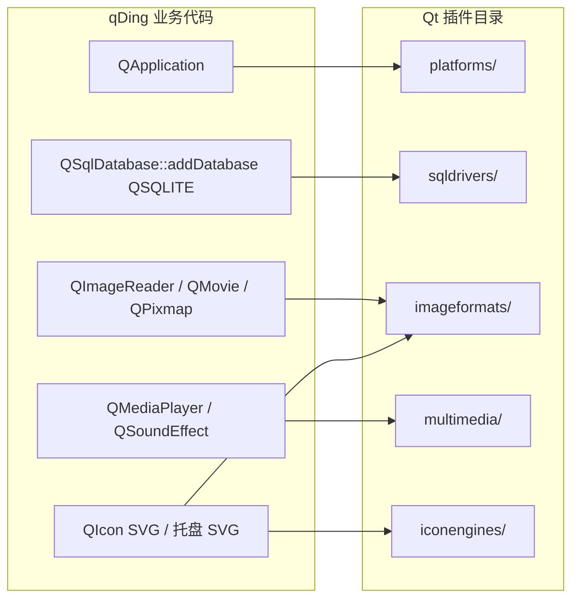

# Qt 插件：原理与 qDing 中的用法

qDing **不实现自己的业务插件**（没有 `Q_PLUGIN_METADATA` / 自定义 `QPluginLoader` 接口）。应用通过链接 Qt 模块（Sql、Gui、Multimedia、Svg 等）间接依赖 Qt 官方提供的**平台、图像、数据库、多媒体**插件。本文说明 Qt 插件机制本身，以及本仓库如何选择、部署与验证这些插件。

相关代码入口：

| 位置 | 作用 |
|------|------|
| `CMakeLists.txt`（`qding_deploy_options`） | 安装时决定拷贝哪些插件，并交给 `windeployqt` / `macdeployqt` |
| `scripts/package-*.{sh,ps1}` | 部署后清掉开发机插件环境变量，用 `QT_QPA_PLATFORM=offscreen` 做启动检查 |
| `src/storage/storage.cpp` | `QSqlDatabase::addDatabase("QSQLITE")` → 需要 `sqldrivers` 插件 |
| `src/services/media.cpp`、`src/ui/popup.cpp` | `QImageReader` / `QMovie` / `QPixmap` → 需要 `imageformats` |
| `src/ui/popup.cpp`（`QMediaPlayer`） | 自定义音频 → 需要 `multimedia` 后端插件 |
| `src/main.cpp`、托盘图标 | SVG 资源 / 图标 → 需要 `iconengines` / `imageformats` 中的 SVG 支持 |
| 测试与 smoke | `QT_QPA_PLATFORM=offscreen` → 需要 `platforms` 里的 `qoffscreen` |

---

## 1. 为什么 Qt 要用插件

Qt 把许多**可选、平台相关、体积较大**的能力做成动态库插件，而不是全部静态链进每一个应用：

1. **按需加载**：只有真正打开 SQLite、解码 GIF、播 MP3 时才加载对应驱动。
2. **平台隔离**：Windows / macOS / Linux 的窗口系统集成（QPA）各自是独立插件，同一套 Widgets 代码可换后端。
3. **部署可控**：发布包可以只带应用真正用到的驱动，避免把 MySQL/ODBC/Mimer 等整组 SQL 驱动都打进去。
4. **版本与 ABI**：插件与主程序使用同一套 Qt 主版本；`windeployqt` / `macdeployqt` 按可执行文件依赖去拷贝匹配的插件。

对用户可见的后果是：开发机上“能跑”，不等于便携包能跑——若发布目录缺少 `platforms/qwindows.dll` 或 `sqldrivers/qsqlite.dll`，程序会在创建 `QApplication`、打开数据库或读图时报错/崩溃。

---

## 2. 机制概览

### 2.1 接口与元数据

Qt 插件通常是实现某个 **接口类**（如 `QPlatformIntegrationPlugin`、`QSqlDriverPlugin`、`QImageIOPlugin`）的共享库，并用宏声明元数据：

```cpp
// Qt 官方插件内部（示意，非本仓库代码）
class QSQLiteDriverPlugin : public QSqlDriverPlugin {
    Q_OBJECT
    Q_PLUGIN_METADATA(IID QSqlDriverFactoryInterface_iid FILE "sqlite.json")
public:
    QSqlDriver *create(const QString &key) override;
};
```

- `Q_PLUGIN_METADATA`：把 IID、JSON 元数据编进插件，供 `QPluginLoader` / 工厂查找。
- 应用侧多数时候**不直接** `QPluginLoader`；而是调用高层 API（`addDatabase`、`QImageReader`），由 Qt 内部工厂按 key 加载插件。

### 2.2 查找路径

运行时 Qt 大致按下列顺序查找插件目录（概念顺序，细节因版本/平台略有差异）：

1. 环境变量 `QT_PLUGIN_PATH`（可含多个路径）
2. 环境变量 `QT_QPA_PLATFORM_PLUGIN_PATH`（仅平台插件）
3. 可执行文件旁的约定目录（见下节“目录布局”）
4. Qt 安装前缀下的 `plugins/`（开发机常见）

因此：**开发机若设置了 `QT_PLUGIN_PATH` 指向 SDK，即使发布包漏了插件，程序仍可能“碰巧能启动”**。打包脚本故意清除这些变量，就是为了暴露漏打包问题。

### 2.3 平台插件（QPA）

`QGuiApplication` / `QApplication` 启动时必须加载一个 **QPA（Qt Platform Abstraction）** 插件，例如：

| 插件 | 典型文件 | 用途 |
|------|----------|------|
| windows | `platforms/qwindows.dll` | 正常 Windows GUI |
| cocoa | `PlugIns/platforms/libqcocoa.dylib` | 正常 macOS GUI |
| offscreen | `qoffscreen` | 无显示器/CI/自动化；无真实窗口系统 |

选择方式：

- 默认：按操作系统选原生插件。
- 覆盖：`QT_QPA_PLATFORM=offscreen`（本仓库测试与部署 smoke 使用）。

业务代码里可用 `QGuiApplication::platformName()` 判断，例如弹窗淡入在 offscreen 上不可用时跳过透明度动画（见 `src/ui/popup.cpp`）。

### 2.4 功能插件与高层 API 的对应



应用**不写插件加载代码**；链接 `Qt6::Sql` 等模块后，Qt 在首次使用对应功能时按 key 打开插件。

---

## 3. qDing 实际依赖的插件清单

依据代码路径与部署配置（`CMakeLists.txt` 中 macOS 显式列表；Windows 由 `windeployqt` 按模块扫描，并额外包含 `qoffscreen`）：

| 类型 (`QT_PLUGIN_TYPE`) | macOS 目标名（CMake） | 典型文件名 | 业务触发点 |
|-------------------------|----------------------|------------|------------|
| `platforms` | `QCocoaIntegrationPlugin` | `libqcocoa.dylib` | 正常启动 GUI |
| `platforms` | `QOffscreenIntegrationPlugin` | `libqoffscreen.dylib` | 测试 / 打包 smoke |
| `sqldrivers` | `QSQLiteDriverPlugin` | `libqsqlite.dylib` | `storage.cpp` 打开 `qding.sqlite` |
| `imageformats` | `QGifPlugin` / `QJpegPlugin` / `QSvgPlugin` | `libqgif` 等 | 提醒图 PNG/JPEG/GIF；SVG |
| `iconengines` | `QSvgIconPlugin` | `libqsvgicon.dylib` | 托盘等 SVG 图标 |
| `multimedia` | `QDarwinMediaPlugin` / `QFFmpegMediaPlugin` | 平台/FFmpeg 后端 | `QMediaPlayer` 播自定义音频 |

Windows 对应物在 `bin/plugins/platforms/`、`bin/plugins/sqldrivers/`、`bin/plugins/imageformats/`、`bin/plugins/multimedia/`、`bin/plugins/iconengines/` 下，例如 `qwindows.dll`、`qsqlite.dll`、`qgif.dll`、`qoffscreen.dll`。

**刻意不带的插件（macOS）**：整个 SQL 驱动组（MySQL、PostgreSQL、Mimer 等）。应用只用 SQLite；默认 `macdeployqt` 可能把整组拷入，并连带未安装客户端库的外部依赖，故使用 `-no-plugins` 后按上表手工安装。

PNG 在 Qt 中常由内建支持或与部署工具默认集合一起带上；业务仍接受 `png` 后缀（`MediaService::importFile`）。发布后应在干净机器上实测 GIF/JPEG/SQLite/音频，而不是只看部署工具退出码。

---

## 4. 运行时：代码如何“用到”插件

### 4.1 平台插件

```cpp
// main.cpp — 构造 QApplication 即加载 QPA
QApplication app(argc, argv);
```

无有效 `platforms` 插件时，进程通常在此时失败（日志里常见 “Could not find the Qt platform plugin …”）。

测试：

```cmake
# CMakeLists.txt
set_tests_properties(... PROPERTIES ENVIRONMENT "QT_QPA_PLATFORM=offscreen" ...)
```

### 4.2 SQL 驱动插件

```cpp
// storage.cpp
db_ = QSqlDatabase::addDatabase(QStringLiteral("QSQLITE"), connectionName_);
```

字符串 `"QSQLITE"` 是驱动 key；对应插件实现 `QSqlDriverPlugin::create`。缺少 `qsqlite` 时 `open()` 失败，应用无法初始化存储。

### 4.3 图像格式插件

```cpp
// media.cpp — 导入前探测能否解码
QImageReader reader(source);
if (!reader.canRead() || ...)

// popup.cpp — GIF 动画 / 静态图
QMovie movie(path, ...);
QPixmap pix(path);
```

`QImageReader` / `QMovie` 按文件格式选择 `imageformats` 插件。GIF 缺插件时导入或弹窗解码失败（弹窗侧会隐藏图片并打日志，文字提醒仍可用）。

### 4.4 多媒体插件

```cpp
// popup.cpp — NotificationCoordinator
player_ = new QMediaPlayer(this);
// 失败时回退内置 WAV（QSoundEffect）
```

自定义 MP3/OGG 等依赖 Multimedia 后端（macOS 上 Darwin/FFmpeg 插件）；WAV 回退路径降低对复杂后端的硬依赖，但部署仍应带上官方 multimedia 插件以免自定义音频静默失败。

### 4.5 SVG / 图标引擎

```cpp
// main.cpp — 应用图标含 SVG
icon.addFile(QStringLiteral(":/branding/qding.svg"));
// mainwindow.cpp — 托盘
trayIcon = QIcon(QStringLiteral(":/branding/tray.svg"));
```

预渲染 PNG 已加入图标，减轻对 SVG 插件加载时机的敏感；托盘 SVG 仍依赖 SVG 相关插件在目标机可用。

---

## 5. 部署：本仓库怎么打包插件

### 5.1 统一入口：`qt_generate_deploy_app_script`

```cmake
qt_generate_deploy_app_script(TARGET qDing OUTPUT_SCRIPT deploy_script
    NO_UNSUPPORTED_PLATFORM_ERROR DEPLOY_TOOL_OPTIONS ${qding_deploy_options})
install(SCRIPT ${deploy_script})
```

`cmake --install` 时执行生成的脚本，内部调用：

- **Windows**：`windeployqt`
- **macOS**：`macdeployqt`

### 5.2 macOS：显式白名单

策略：

1. `-no-plugins`：禁止部署工具按默认规则拷贝全部插件组。
2. 对每个需要的 `Qt6::<Plugin>` 目标：
   - 读 `QT_PLUGIN_TYPE`（如 `platforms`、`sqldrivers`）；
   - `install(FILES ...)` 到 `qDing.app/Contents/PlugIns/<type>/`；
   - 再把该插件路径以 `-executable=...` 交给 `macdeployqt`，让工具解析插件自身的 `.dylib` 依赖。

`.app` 内典型布局：

```text
qDing.app/Contents/
├── MacOS/qDing
├── Frameworks/          # Qt 框架与依赖
└── PlugIns/
    ├── platforms/
    ├── sqldrivers/
    ├── imageformats/
    ├── iconengines/
    └── multimedia/
```

### 5.3 Windows：扫描 + 补 offscreen

`windeployqt` 根据链接的 Qt 模块拷贝 DLL 与常用插件（含 `qwindows`、SQL、图像、多媒体等）。

本仓库额外：

- `--include-plugins qoffscreen`：打包脚本的部署后检查强制 `QT_QPA_PLATFORM=offscreen`，而默认部署往往只有 `qwindows`。不包含 `qoffscreen` 时，**发布包在干净环境下的 smoke 会失败**，即使最终用户用图形界面启动并不需要 offscreen。
- Windows 使用 `qt_generate_deploy_script` 指定 `PLUGINS_DIR bin/plugins` 与 `QT_DEPLOY_TRANSLATIONS_DIR bin/translations`，避免 Qt 默认把 `plugins/`、`translations/` 放在安装前缀根（与 `bin/` 平级）。

便携包布局（示意）：

```text
qDing-…-Windows-x64/
├── bin/
│   ├── qDing.exe
│   ├── Qt6*.dll
│   ├── qt.conf
│   ├── plugins/
│   │   ├── platforms/qwindows.dll
│   │   ├── platforms/qoffscreen.dll
│   │   ├── sqldrivers/qsqlite.dll
│   │   ├── imageformats/…
│   │   └── multimedia/…
│   └── translations/…
└── 运行说明.txt
```

### 5.4 部署后验证（关键）

两平台脚本在安装完成后：

1. 从 `PATH` 去掉 Qt SDK 的 `bin`（Windows），或至少不依赖 SDK 插件路径。
2. 清除 `QT_PLUGIN_PATH`、`QT_QPA_PLATFORM_PLUGIN_PATH`。
3. 设置 `QT_QPA_PLATFORM=offscreen`，运行 `qDing --smoke-test`。

这样验证的是：**发布目录自带的插件是否足够让应用完成初始化与界面冒烟**，而不是开发机 SDK 是否完整。

---

## 6. 开发机 vs 发布包

| 场景 | 插件从哪来 | 注意 |
|------|------------|------|
| 本机 `cmake --build` 后直接运行 | 通常从 `CMAKE_PREFIX_PATH` 的 Qt SDK `plugins/` | `PATH` / 环境变量指向 SDK 时很常见 |
| `ctest`（Windows 打包脚本） | 临时把 SDK `bin` 加进 `PATH` | 构建树本身未部署 DLL |
| `cmake --install` 产物 / `dist/` 包 | macOS：`PlugIns/`；Windows：`bin/plugins/` | 必须自洽；脚本会清环境变量再测 |
| 用户解压 ZIP / 打开 `.app` | 仅包内插件 | 不要只拷贝单个 EXE |

调试插件问题时可设：

```text
QT_DEBUG_PLUGINS=1
```

进程会打印插件搜索路径与加载成败（输出较吵，仅排查用）。

---

## 7. 与“自定义插件架构”的区别

| | Qt 官方功能插件（本仓库用法） | 应用级插件（本仓库未做） |
|--|------------------------------|-------------------------|
| 目的 | 平台/驱动/编解码后端 | 扩展业务功能、第三方模块 |
| 接口 | Qt 已定义（Sql/Image/QPA…） | 自己 `Q_DECLARE_INTERFACE` |
| 加载 | 工厂 + key，业务无感 | 显式 `QPluginLoader` |
| 部署 | `windeployqt` / `macdeployqt` / 手工白名单 | 自己约定目录与版本策略 |

若将来要做“提醒动作插件”“主题包动态加载”等，需另设计接口与目录，与本文描述的 Qt 功能插件是不同一层。

---

## 8. 维护清单

新增依赖某类能力时，按此核对：

1. **代码**：是否调用了新的 Qt API（新图像格式、新 SQL 驱动、新多媒体格式）？
2. **CMake**：macOS 白名单是否补上对应 `Qt6::*Plugin`？Windows 是否需 `--include-plugins`？
3. **打包脚本**：smoke 若换平台名，是否仍包含该平台插件？
4. **文档**：`docs/building.zh-CN.md` 部署说明是否同步？
5. **干净机器**：无 Qt SDK 的环境上打开库、读一张 GIF、播一段自定义音频。

常见故障对照：

| 现象 | 优先检查 |
|------|----------|
| Could not find the Qt platform plugin | `platforms/` 是否随包；环境是否指错路径 |
| Driver not loaded / Unable to open database | `sqldrivers/qsqlite` |
| 图片空白 / `canRead` 失败 | `imageformats`（尤其 gif/jpeg） |
| 自定义音频失败、仅 WAV 回退 | `multimedia` 后端插件与系统编解码 |
| 开发机能跑、ZIP 不能 | 是否清过 `QT_PLUGIN_PATH` 做部署检查；是否只拷了 EXE |

---

## 9. 参考

- [Qt Deployment](https://doc.qt.io/qt-6.8/deployment.html)
- [How to Create Qt Plugins](https://doc.qt.io/qt-6.8/plugins-howto.html)（机制与自定义插件）
- [QPA 插件](https://doc.qt.io/qt-6.8/qpa.html)
- 本仓库：[构建与发布](building.zh-CN.md)、[代码导读](code-guide.zh-CN.md)
